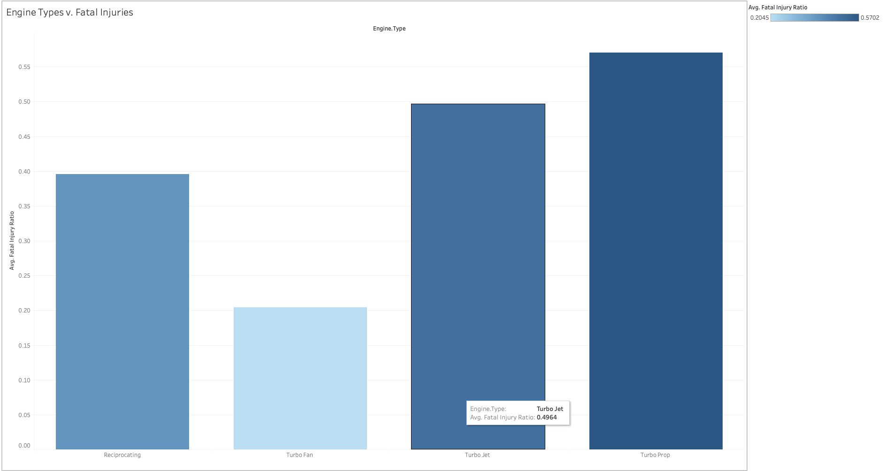
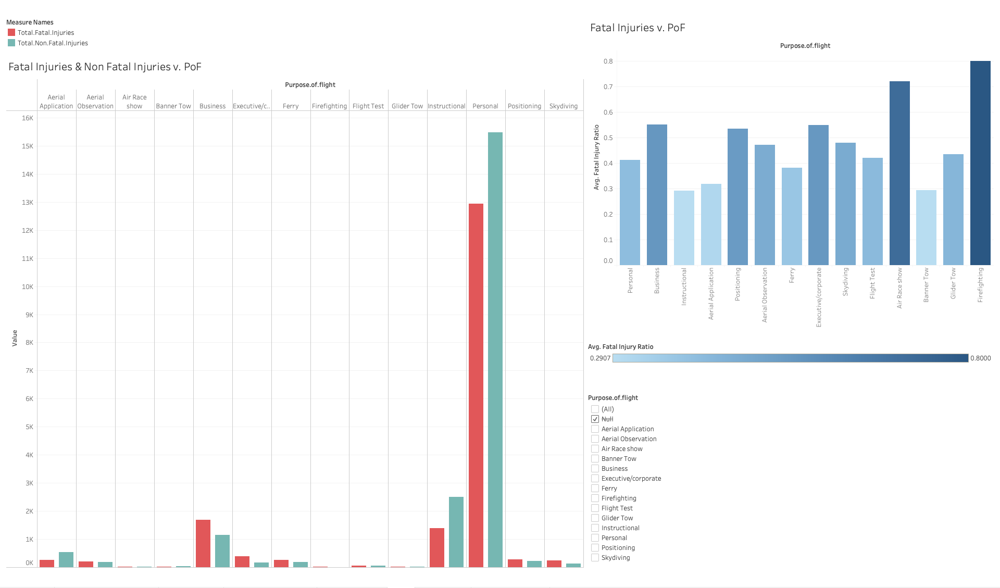

# Phase 1 Project

## Summary

### Business Problem

Determine lowest risk aviation sectors for company to invest in.

### Project Outline

1. Import data from csv file
2. Clean data
3. Feature engineering
4. Data analysis

## Running the Notebook

1. Clone the repository

```bash
git clone https://github.com/oblomovite/dsc-phase-1-project-v3.git && cd dsc-phase-1-project-v3
```

2. Use the package manager [pip](https://pip.pypa.io/en/stable/) to install the required packages

```bash
pip install -r requirements.txt
```

3. Run the notebook

```bash
jupyter notebook
```

## Presentation

The presentation can be found [here](flatiron-phase-1-project.pdf).

## Tableau Dashboard

The Tableau dashboard can be found [here](dsc-phase-1-project-v3.twb).

Examples of the dashboard are here:

- 
- 
- 
