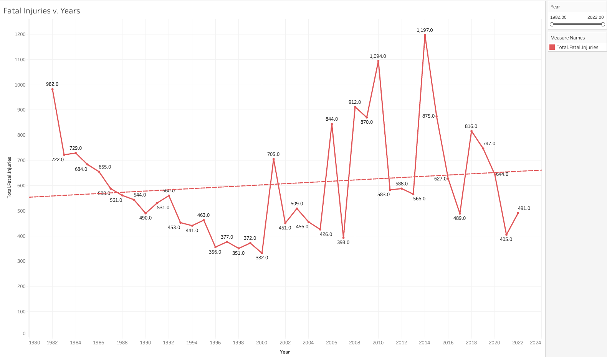

# Phase 1 Project

## Summary

### Data

The [raw dataset](./data/Aviation_Data.csv) and the derivative [sanitized_dataset](./data/Aviation_Data_Cleaned.csv) are sourced from Kaggle. It is an aggregated report containing information about Incidents and Accidents of various Aircraft.

### Business Problem

Determine lowest risk aviation sectors for a company to invest in.

### Methodology

- Perform EDA to discover any macro level trends
- Calculate risk using a ratio of Fatal Injuries to total injuries
- Apply this calculation to Engine Types and Purpose of Flight
- Create Visualizations to aid conclusions & findings

### Solution & Findings

- Fatal Injuries have generally increased across all airplane-based flights
- Reciprocating and Turbofan are the safest engine types
- Banner Tow, Aerial Application, and Instructional are the safest purposes of flight

## Running the Notebook

1. Clone the repository

```bash
git clone https://github.com/oblomovite/dsc-phase-1-project-v3.git && cd dsc-phase-1-project-v3
```

2. Use the package manager [pip](https://pip.pypa.io/en/stable/) to install the required packages

```bash
pip install -r requirements.txt
```

3. Run the notebook

```bash
jupyter notebook
```

## Presentation

The presentation can be found [here](flatiron-phase-1-project.pdf).

## Tableau Dashboard

The complete Tableau worksbook can be found [here](dsc-phase-1-project-v3.twb).

Examples of the dashboard are here:

- 
- 
- 

## Project Structure

```markdown
├── README.md
├── requirements.txt
├── dsc-phase-1-project-v3.twb
├── flatiron-phase-1-project.pdf
└── images
├── fatal_injuries_years_dashboard.png
├── engine_types_dashboard.png
└── PoF_dashboard.png
```
